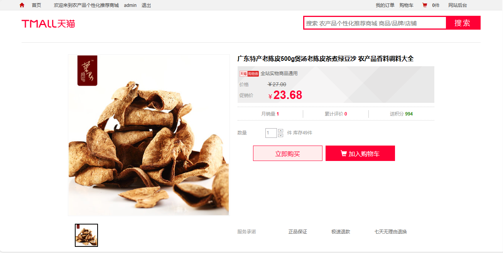
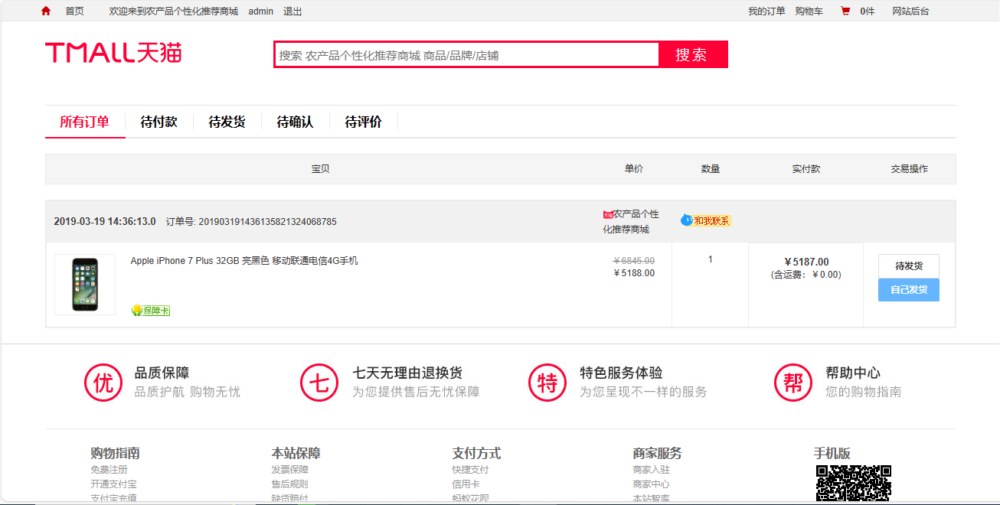
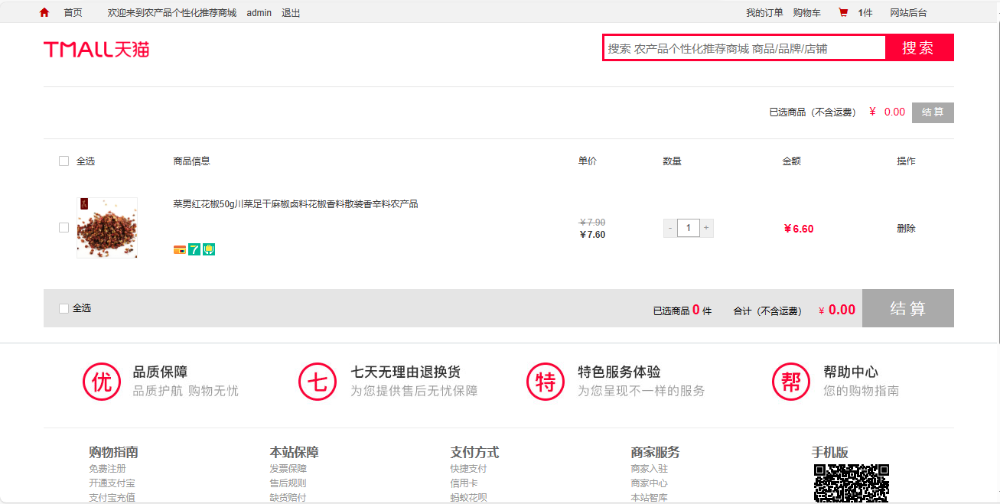
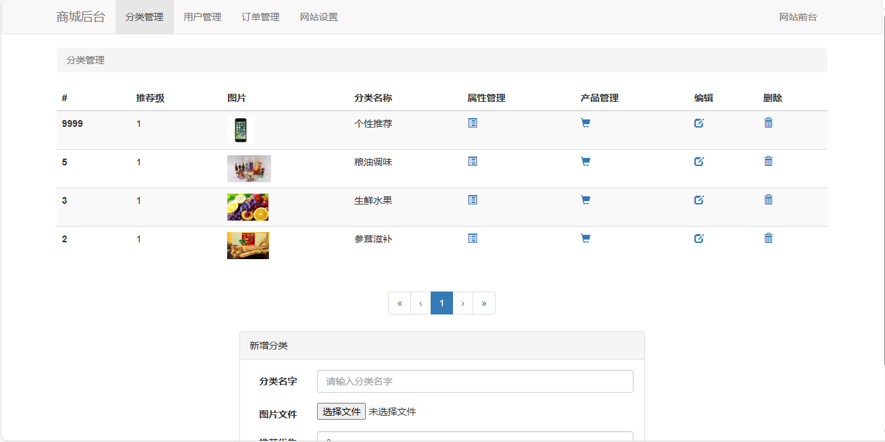
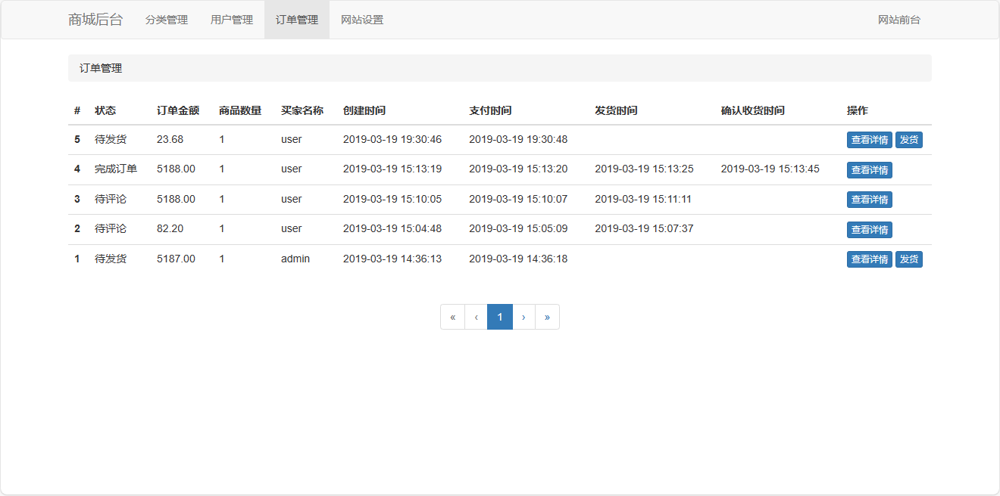
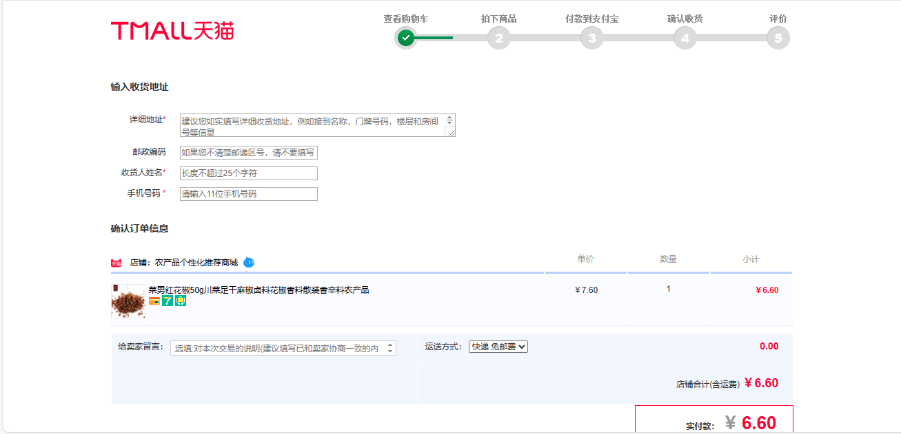

<h1 align="center">32.基于ssh天猫商城管理系统</h1>

- <b>完整代码获取地址：从戎源码网 ([https://armycodes.com/](https://armycodes.com/))</b>
- <b>技术探讨、资料分享，请加QQ群：692619798</b> 
- <b>作者微信：19941326836  QQ：952045282</b> 
- <b>承接计算机毕业设计、Java毕业设计、Python毕业设计、深度学习、机器学习</b>
- <b>选题+开题报告+任务书+程序定制+安装调试+论文+答辩ppt 一条龙服务</b>
- <b>所有选题地址 ([https://github.com/YuLin-Coder/AllProjectCatalog](https://github.com/YuLin-Coder/AllProjectCatalog)) </b>

## 项目介绍

基于ssh天猫商城管理系统：前端 jsp、bootstrap、jquery，后端 struts、spring、hibernate，一个模仿天猫商城的学习网站系统，产品管理、商品展示、购物车、在线结算等。

## 主要功能

- 首页：商品分类展示、个性推荐、首页图片轮播
- 商品购买：商品详情、立即购买、加入购物车、累积评价、销量展示、查看购物车、收货地址填写、提交订单、在线支付、确认收货、评价
- 订单：订单列表、所有订单、待付款、待发货、待确认、待评价、订单再付款、自己发货
- 分类管理：分类列表、新增分类、编辑分类、删除分类
- 产品管理：产品列表、新增产品、产品图片管理（图片上传，封面图片、顶部图片、详情图片）、属性值管理、产品信息编辑、产品信息删除
- 用户管理：用户列表
- 订单管理：订单列表、查看详情、发货
- 网站设置：网站名称、首页描述、首页关键词、首页标题、产品图片存放目录、分类图片存放目录

## 环境

- <b>IntelliJ IDEA</b>

- <b>Mysql 5.7</b>

- <b>Tomcat 9.x</b>

- <b>JDK 1.8</b>

## 运行截图

